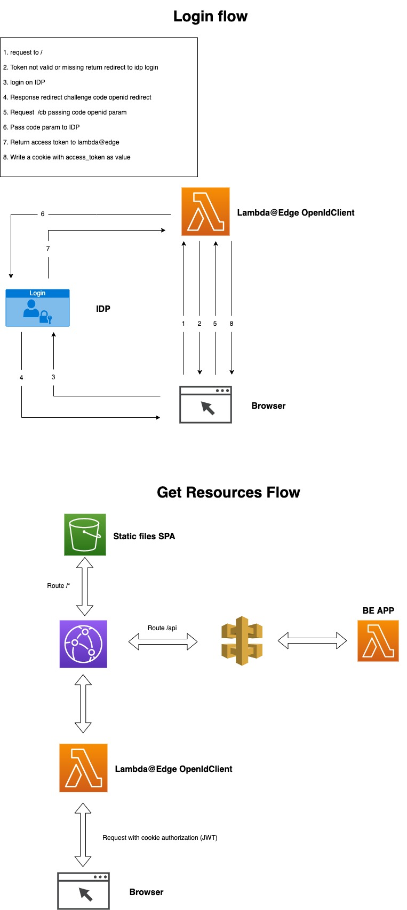

# Open id client serverless

## Description
A simple Lambda@Edge which provides to implement the openID authentication through the **Authorization code flow**
and validation of jwt token contained in a cookie.

## Installation
Deploy the lambda on us-east-1, configure the environment variables and then set the Lambda@Edge on **Origin request event**
on the route which has to be secured.

## Environment variables
The environment variables have to be setup as custom header in the origin section of cloud front, and the headers necessaries are:
* CLIENT_ID - client id
* CLIENT_SECRET - client secret
* DOMAIN - root domain of the application
* IDP_METADATA_URL - Url of the idp (the library will add automatically the standard context /.well-known/openid-configuration)